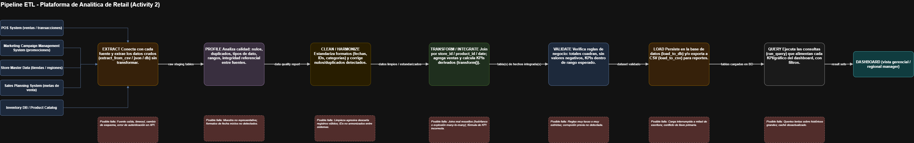

# Lab 1: Retail Analytics Platform

`Johann Eduardo Gonzalez Sandoval`
`Juan David Lasso Chaparro`

## 1. Project overview

This project implements the ETL pipeline that turns the raw, multi-format
sales data into a single analytical dataset and SQLite
database that a retail dashboard could query directly. It follows the
standard **Extract → Profile → Clean → Transform/Integrate →
Validate → Load → Query** flow.

The client's original request was a simple one: *"we want a dashboard."*
This project treats that request as the starting point of an analysis,
not as a coding task. Before writing a single line of extraction code,
the highest-priority business requirements were traced
end-to-end, and the pipeline itself was designed as a block
diagram before implementation began. Every design decision documented
below is a direct response to either a business requirement or a
specific finding from data profiling.

---

## 2. Before coding

The planning activities were completed before any script was written, so
that the pipeline could be built with a clear picture of the data needed
and the tools available, instead of discovering requirements mid-code.

### Review and Trace the Requirements

| Business Requirement | Required Data | Pipeline Block | Expected Output |
|---|---|---|---|
| Monitor store performance against sales targets to support timely business decisions | `monthly_targets.csv` | Transform and integrate → `net_sales`, `month`; joined with `monthly_targets.csv` | `sales_analytics` table with `net_sales` vs `sales_target` per store/month |
| Optimize commercial decision-making through early detection of underperforming products | `products.csv` | Clean → numeric conversion, date parsing; Transform and integrate → join with `products.csv`, compute `net_sales` | Category-level sales table showing which categories are declining |
| Compare sales performance across different regions to support strategic planning | `stores.csv` | Transform and integrate → join with `stores.csv` to append `region` | Region/store sales ranking table |
| Improve the effectiveness of marketing campaigns based on store performance | `promotions.csv` | Clean → standardize `promotion_code` (incl. missing-value marker); Transform and integrate → join with `promotions.csv`, compute `discount_amount`, `net_sales` | Promotion effectiveness table by campaign |
| Measure the effectiveness of pricing and discount strategies on sales performance | `promotions.csv` | Transform and integrate → compute `gross_sales`, `discount_amount`, `net_sales` | Pricing/discount impact table by product |
| Provide an intuitive and user-friendly dashboard for managers with different levels of technical experience | Aggregated fields from `sales_analytics` | Load → SQLite `sales_analytics` table; Query → simple menu | Clean, pre-aggregated SQLite table that a simple dashboard/menu can query directly without further processing |

### Design the Pipeline

| Block | Input | Responsibility | Output | Possible Failure |
|---|---|---|---|---|
| Extract | Raw files: `sales_cali.csv`, `sales_bogota.json`, `sales_medellin.xml`, `products.csv`, `stores.csv`, `promotions.csv`, `monthly_targets.csv` | Read each source and map transaction fields to a common schema | 3 raw sales DataFrames + 4 reference DataFrames | Missing/renamed source file; malformed JSON or XML structure; a source using a field name not covered by the field map |
| Profile | Combined raw sales DataFrame | Measure row count, dtypes, missing values, duplicates, invalid quantities/prices/dates, distinct categorical values | `profiling_summary.json` + log entries with counts | Profiling logic itself errors on an unexpected data shape (e.g., a completely empty source) |
| Clean and harmonize | Combined raw sales DataFrame + profiling findings | Standardize IDs and text casing, parse dates, convert numeric fields, remove duplicates, reject invalid quantity/price/date rows, unify missing promotion codes | Clean DataFrame + `rejected_sales.csv` with `rejection_reason` | A rule rejects far more rows than expected, leaving too little data to be useful; an unseen dirty-value variant slips through uncleaned |
| Transform and Integrate | Clean sales DataFrame + `products.csv`, `stores.csv`, `promotions.csv`, `monthly_targets.csv` | Join reference tables; compute `gross_sales`, `discount_amount`, `net_sales`, `month`, `week`, `day_name`; attach `sales_target` | Integrated DataFrame | A `product_id` or `store_id` with no match in the master table produces nulls after the join; a store/month with no defined target leaves `sales_target` empty |
| Validate | Integrated DataFrame + `products.csv`, `stores.csv` | Run final quality gate: uniqueness, required fields not null, positive amounts, product/store referential integrity, `net_sales` formula consistency | Boolean `passed` flag + list of failed checks, logged | A critical check fails (e.g., a product not in the master) and the pipeline must stop before loading, leaving no CSV/DB update |
| Load | Validated integrated DataFrame | Persist the dataset as the analytical output | `data/processed/integrated_sales.csv` + `sales_analytics` table in `retail_analytics.db` | Disk/permission error writing the CSV; SQLite connection or write failure |
| Query | `sales_analytics` table in `retail_analytics.db` | Run predefined analytical queries tied to business questions, read only from the database | Category, region/store, target achievement, promotion, pricing, and trend tables | Database file not found; query references a column that doesn't exist if the schema changes upstream |

---

### Pipeline diagram



*(Full version: `docs/Pipeline_Diagram.png`)*

## 4. Selected business requirements

The six highest-priority requirements selected for this first version of
the pipeline (Lab 1A, section 2) and the KPI/query that satisfies each
one:

| Business Objective | Query / KPI that satisfies it |
|---|---|
| Improve the effectiveness of marketing campaigns based on store performance | Query 4 – Promotion effectiveness by campaign |
| Monitor store performance against sales targets to support timely business decisions | Query 3 – Store target achievement (`net_sales` vs `sales_target`) |
| Optimize commercial decision-making through early detection of underperforming products | Query 1 – Product category performance |
| Compare sales performance across different regions to support strategic planning | Query 2 – Sales by region and store |
| Measure the effectiveness of pricing and discount strategies on sales performance | Query 5 – Pricing and discount impact by product |
| Provide an intuitive and user-friendly dashboard for managers with different levels of technical experience | `sales_analytics` as a single pre-aggregated, query-ready table + simple query menu (`queries.py`) |

Full traceability from each requirement to its required data, pipeline
block, and expected output is in **section 2, Activity 1**.

---

## 5. Project structure

```
Lab1B_ETL/
├── data/
│   ├── raw/           # Source files exactly as delivered by the client
│   ├── processed/      # Pipeline outputs (CSV, profiling summary, rejected rows)
│   └── output/         # Reserved for further downstream exports
│
├── database/
│   └── retail_analytics.db   # SQLite analytical database (generated)
│
├── src/
│   ├── extract.py      # Extraction block
│   ├── transform.py     # Profiling, cleaning, integration, validation
│   ├── load.py          # CSV + SQLite loading
│   ├── queries.py       # Analytical query menu
│   ├── log.py           # Logging utility
│   └── main.py           # Pipeline orchestrator (entry point)
│
├── logs/
│   └── log_file.txt      # Execution log (generated)
│
├── docs/
│   └── pipeline_diagram.png
│
├── requirements.txt
├── .gitignore
└── README.md
```

---

## 6. Execution instructions

### Requirements

- Python 3.10+

### 1. Create and activate a virtual environment

Using an isolated environment avoids version conflicts with libraries
already installed on your system.

**Windows:**
```bash
python -m venv .venv
.venv\Scripts\activate.ps1
```

**macOS / Linux:**
```bash
python3 -m venv venv
source venv/bin/activate
```

### 2. Install dependencies

```bash
pip install -r requirements.txt
```

### 3. Run the full pipeline

From the project root:

```bash
python src/main.py
```

This single command runs Extract → Profile → Clean/Harmonize →
Transform/Integrate → Validate → Load in order, and produces:

- `data/processed/integrated_sales.csv`
- `data/processed/profiling_summary.json`
- `data/processed/rejected_sales.csv` (only if any rows were rejected)
- `database/retail_analytics.db`
- `logs/log_file.txt`

### 4. Run the analytical query menu

After `main.py` has run at least once (so the database exists):

```bash
python src/queries.py
```

Select a query number from the menu, or `0` to exit.

### 5. Deactivate the virtual environment (when done)

```bash
deactivate
```

---

## 7. Technologies used

| Technology | Role in the project |
|---|---|
| Python 3.10+ | Core language for the entire pipeline |
| pandas | DataFrame manipulation for extraction, profiling, cleaning, and transformation |
| `xml.etree.ElementTree` (standard library) | Parsing the Medellín XML sales source |
| `json` (standard library) | Parsing the Bogotá JSON sales source |
| SQLite (`sqlite3`, standard library) | Analytical database (`retail_analytics.db`), the read layer for all queries |
| `venv` (standard library) | Isolated environment for dependency management |

---

## 8. Example analytical results

Results below come from an actual run of the pipeline against the
provided fictitious raw data (763 combined transactions → 756 valid
after cleaning).

**Query 1 — Product category performance**

| category | total_net_sales | units_sold |
|---|---|---|
| Small Appliances | 81,110,500 | 342 |
| Electronics | 46,873,600 | 280 |
| Home & Office | 30,830,760 | 360 |
| Personal Care | 22,152,000 | 165 |

**Query 2 — Sales by region and store (lowest first)**

| region | store_name | total_net_sales |
|---|---|---|
| Northwest | Medellín Poblado | 57,203,420 |
| Southwest | Cali Norte | 61,434,700 |
| Central | Bogotá Centro | 62,328,740 |

**Query 3 — Store target achievement (sample)**

| store_name | month | actual_sales | sales_target | target_achievement_pct |
|---|---|---|---|---|
| Bogotá Centro | 2026-02 | 21,549,200 | 23,000,000 | 93.7% |
| Bogotá Centro | 2026-03 | 19,242,540 | 24,000,000 | 80.2% |
| Cali Norte | 2026-02 | 22,867,500 | 19,500,000 | 117.3% |
| Cali Norte | 2026-03 | 18,213,200 | 20,500,000 | 88.8% |

These outputs show the pipeline answering the exact business questions
it was designed for: which category is weakest (Personal Care), which
store needs attention (Medellín Poblado has the lowest total net sales),
and which store/month combinations missed their target (e.g., Bogotá
Centro fell short in both February and March).

---

## 9. Verification and reflection

### Activity 11 – Verification of Requirements

*(Completed after running `python src/main.py` and `python src/queries.py`
against the fictitious raw data.)*

| Business Requirement | Evidence Produced | Satisfied? | Explanation |
|---|---|---|---|
| Monitor store performance against sales targets to support timely business decisions | Query 3 output: `store_name`, `month`, `actual_sales`, `sales_target`, `target_achievement_pct` for all 756 rows (`sales_target` populated for 100% of rows) | Yes | Every transaction successfully joined to its monthly target, so target-vs-actual can be computed per store/month with no gaps. |
| Optimize commercial decision-making through early detection of underperforming products | Query 1 output: `net_sales` and `units_sold` grouped by the 4 categories present (`Home & Office`, `Small Appliances`, `Electronics`, `Personal Care`) | Yes | Category performance is ranked directly from `sales_analytics`, letting a manager immediately see which category has the lowest `net_sales`. |
| Compare sales performance across different regions to support strategic planning | Query 2 output: `net_sales` grouped by the 3 regions (`Southwest`, `Central`, `Northwest`) and by store, ordered ascending | Yes | Regions and stores are ranked from lowest to highest sales, directly supporting a "which region needs attention" decision. |
| Improve the effectiveness of marketing campaigns based on store performance | Query 4 output: `net_sales` and `units_sold` grouped by the 6 campaigns found in the data (e.g. `Coffee Week`, `Audio Campaign`) for the 45 rows with an active discount | Yes | Every promoted transaction is correctly isolated (`promotion_code <> 'NONE'`) and attributed to its campaign, showing which campaigns drove the most net sales. |
| Measure the effectiveness of pricing and discount strategies on sales performance | Query 5 output: average `discount_pct`, `total_discount_given`, and `total_net_sales` per product for the 45 discounted rows | Yes | Discount impact is measurable per product, though the sample of discounted transactions (45 of 756) is small — a fuller promotional history would make the comparison more robust. |
| Provide an intuitive and user-friendly dashboard for managers with different levels of technical experience | `queries.py` runs as a plain numbered menu (0–6) reading from `retail_analytics.db`; pipeline log confirms `ETL Job Completed Successfully` with 756/756 rows validated | Partially | The data layer is clean and query-ready, and the menu itself is simple to use — but this is a query menu, not a visual dashboard, so the actual UI requirement from Lab 1A (charts, filters, wireframe) is not yet implemented in this lab; it would be the next step on top of `sales_analytics`. |

**Conclusion:** five of the six selected business requirements are fully
satisfied by the current pipeline output — the `sales_analytics` table
answers each business question with clean, integrated data and no
missing joins. The sixth requirement (an intuitive dashboard) is only
partially met: the data foundation for it is solid and query-ready, but
the visual layer itself was out of scope for this lab and remains the
next step, consistent with the Lab 1A wireframe.

### Reflection

**A. How did the requirements from Lab 1A influence the design of the pipeline?**
Every column that exists past the raw extraction stage exists because a
specific business requirement needed it. `region` was only added because
of the "compare regions" objective; `discount_pct`/`campaign_name` only
because of the promotion-effectiveness objective; `sales_target` only
because of the target-monitoring objective. Activity 1 (tracing each
requirement to its data, block, and output) was done before writing
`transform.py`, so the integration step never had to guess what to
compute — it implemented exactly the six mappings already defined.

**B. What is the difference between profiling, cleaning, transformation, and validation in your implementation?**
- **Profiling** (`profile_sales`) only *observes* the raw combined data —
  it counts nulls, duplicates, and invalid values but never changes a
  single row.
- **Cleaning** (`clean_sales`) *fixes or removes* what profiling found —
  standardizing casing, parsing dates, converting types, and rejecting
  rows that cannot be trusted (invalid date, quantity ≤ 0, price ≤ 0,
  duplicate ID).
- **Transformation/Integration** (`integrate_sales`) *adds business
  meaning* to already-clean data — joining reference tables and
  computing `gross_sales`, `discount_amount`, `net_sales`, and the
  date-derived fields.
- **Validation** (`validate_sales`) is the *final gate*, checked only
  after integration — it doesn't fix anything, it only confirms the
  integrated result is internally consistent (unique IDs, positive
  amounts, correct `net_sales` formula, full referential integrity) and
  decides whether loading is allowed to proceed.

**C. Why was it necessary to design the system as blocks before coding?**
Designing the block diagram first (Activity 2) forced explicit answers to
"what goes in, what comes out, who is responsible, what can break" for
every stage before any function was written. This is what made it
possible to write `extract.py` without it doing any cleaning, and
`transform.py` without it re-reading raw files — each block's boundary
was already decided on paper. It also made failure handling
straightforward: because "possible failure" was defined per block ahead
of time, `main.py` could log and stop at the right point (e.g., after
validation, before loading) instead of failing unpredictably mid-script.

**D. Which block would be most affected if a branch changed its file format?**
**Extract.** If, say, the Medellín store switched from XML to CSV
tomorrow, only `extract_sales_medellin` would need a new implementation
(swap the XML parser for `pd.read_csv` and remap the field names) — because
every block downstream (Profile, Clean, Transform, Validate, Load, Query)
only ever consumes the common schema (`sale_line_id`, `sale_date`,
`store_id`, ...), never the source-specific field names or format. This
is the direct payoff of keeping extraction free of business logic: the
format is isolated to a single function, and the rest of the pipeline
never needs to change.

**E. Did the team build an ETL pipeline, or did it build a system to solve a business problem? Explain.**
A system to solve a business problem — the ETL pipeline is just the
mechanism it's built from. The starting point was never "let's write an
extract/transform/load script"; it was the client's actual problem
(managers digging through spreadsheets, missed underperforming
products, no regional comparison). Every block exists because a
requirement traced back to it in Activity 1, every cleaning rule exists
because of a specific data quality issue that would otherwise have
produced wrong business numbers, and the KPIs/queries map one-to-one to
the business objectives from Lab 1A, not to "interesting things you
could compute from sales data." The ETL code is the implementation
detail; the deliverable is a trustworthy answer to the client's original
question about their store performance.
